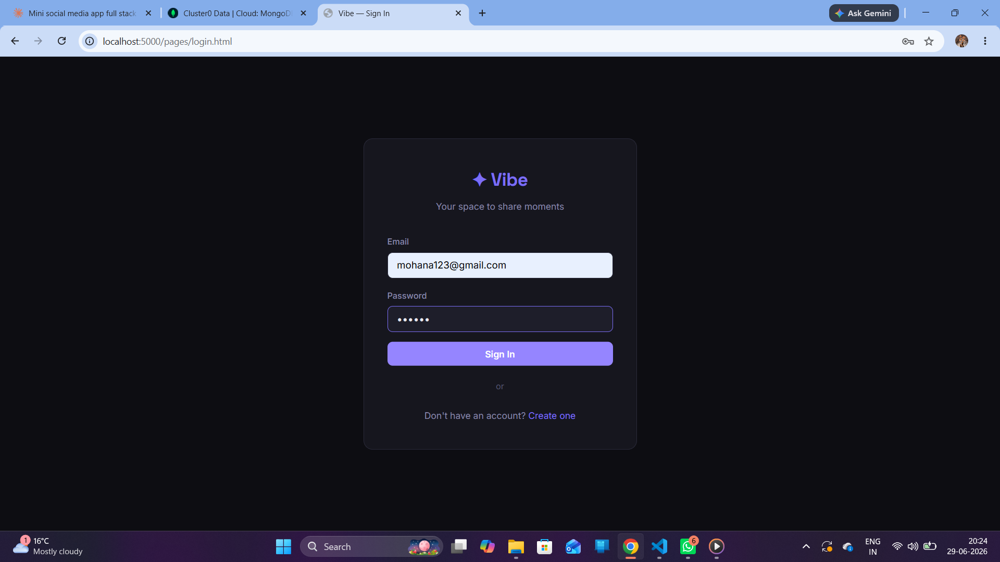
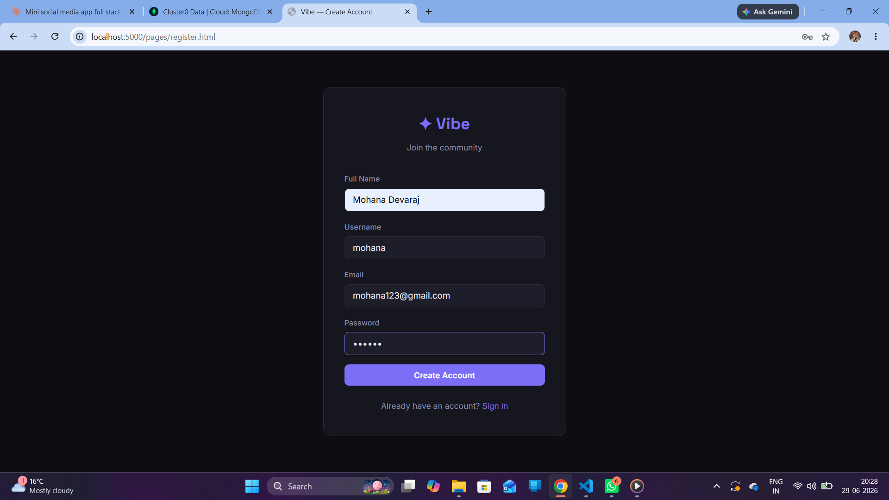
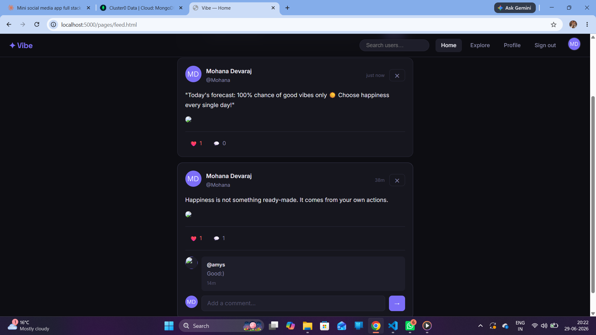
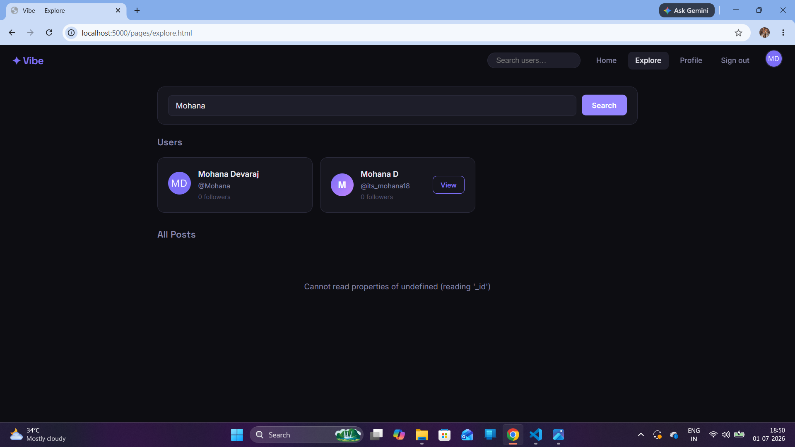
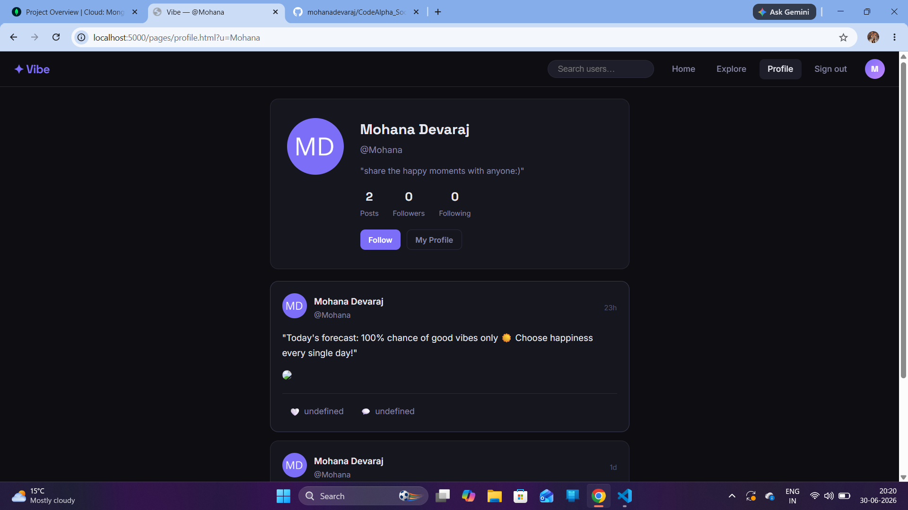
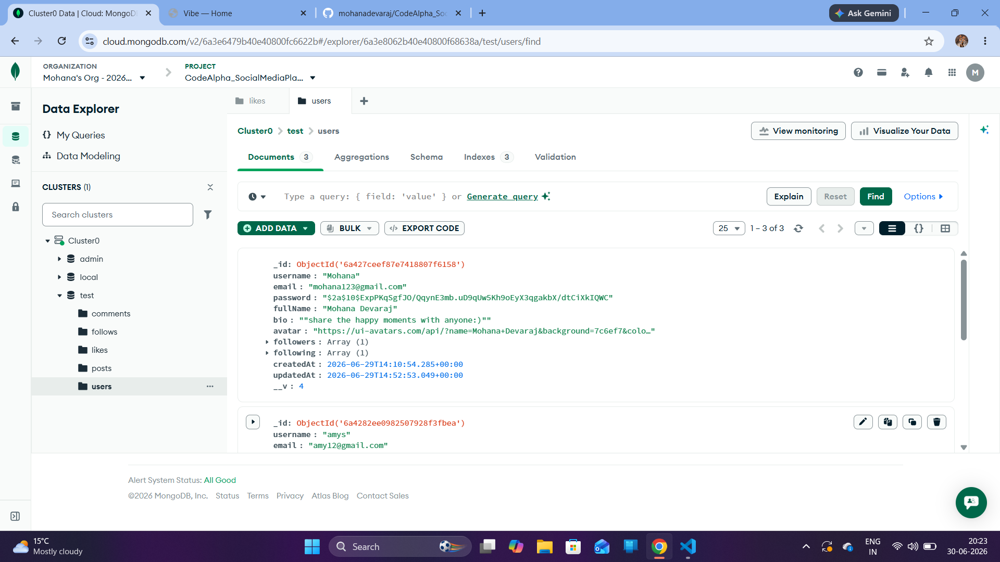
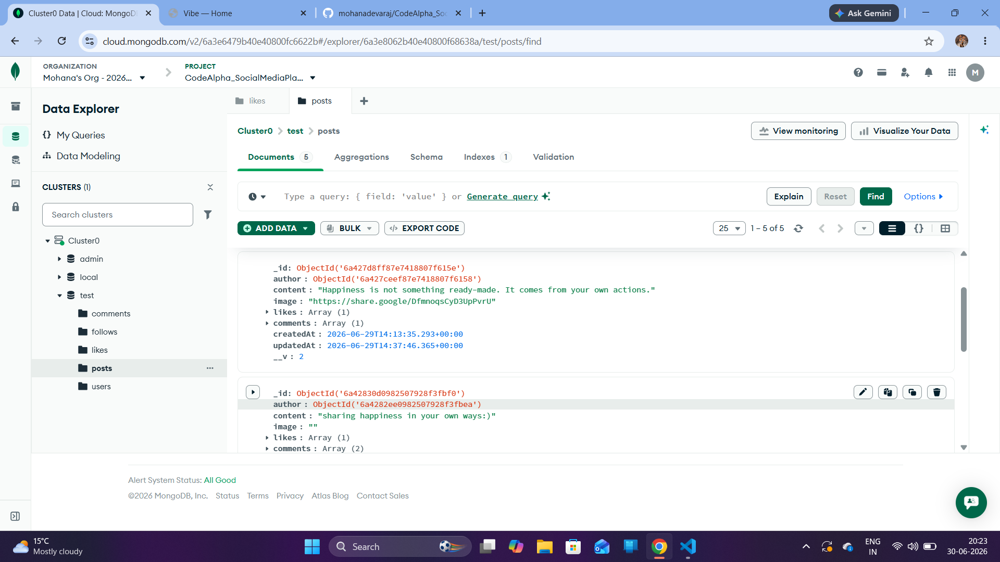
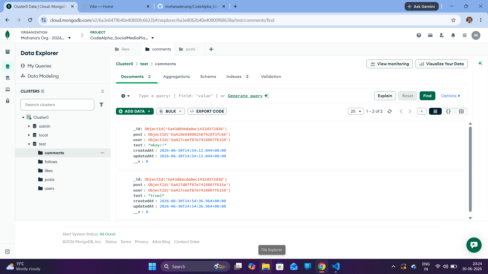
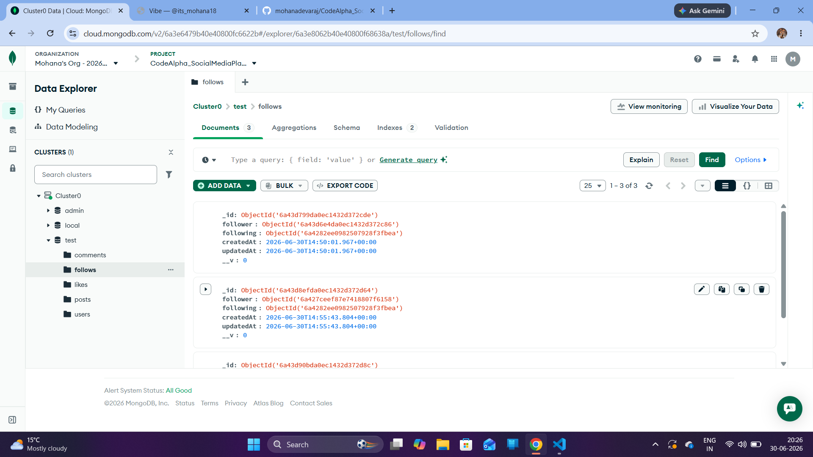
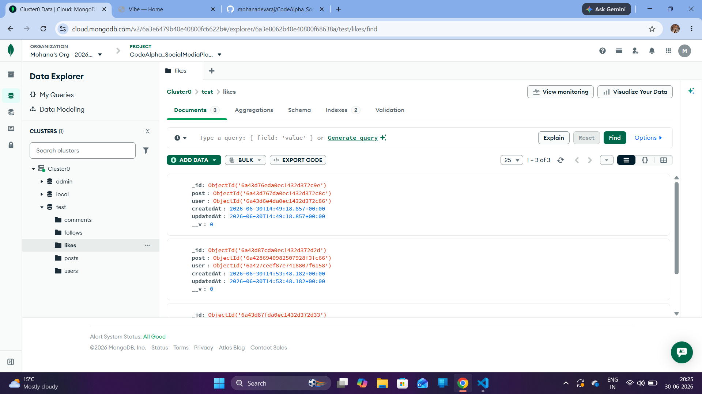

# ✦ Vibe — Mini Social Media App

> A full-stack social media web application where users can share moments, connect with others, and engage through posts, likes, comments, and follows.


---

## 📌 Project Overview

**Vibe** is a mini social media platform built as part of the **CodeAlpha Internship Program**. It replicates core features of modern social media apps like Instagram and Twitter, including user authentication, posting content, liking, commenting, and following other users — all wrapped in a sleek dark-themed UI.

This project demonstrates full-stack web development skills using **Node.js**, **Express.js**, **MongoDB**, and **Vanilla JavaScript** — with no frontend framework, proving that powerful UIs can be built with pure HTML, CSS, and JS. The database is designed with **five separate collections**, following proper relational-style normalization within MongoDB for scalability and clarity.

---

## ✨ Features

### 👤 User Authentication
- Secure **Register & Login** system
- Passwords hashed using **bcryptjs**
- Session management with **JWT (JSON Web Tokens)**
- Protected routes — only logged-in users can post, like, comment, follow

### 🧑‍💼 User Profiles
- Each user has a personal profile page
- Displays **full name, username, bio, avatar**
- Shows **post count, followers count, following count**
- Click followers/following to see the full list
- **Edit Profile** — update name, bio, and avatar URL
- View any user's profile by visiting `/pages/profile.html?u=username`

### 📝 Posts
- Create posts with **text content** (up to 1000 characters)
- Optionally attach an **image via URL**
- Character counter while typing
- Delete your own posts (also cleans up related comments & likes)
- Posts display **author info, timestamp, likes, comments**

### ❤️ Like System
- Toggle like/unlike on any post
- Likes stored as individual documents in a dedicated `likes` collection
- Live like count updates instantly
- Heart icon changes color when liked

### 💬 Comments
- Add comments to any post
- Comments stored as individual documents in a dedicated `comments` collection
- Delete your own comments
- Comments show **author, text, and time**
- Collapsible comment section per post

### 👥 Follow System
- Follow or unfollow any user
- Follow relationships stored as individual documents in a dedicated `follows` collection
- **Home Feed** shows posts only from users you follow
- Followers and Following lists are clickable and viewable
- Follow button updates instantly on profile page

### 🔍 Explore Page
- Browse **all posts** from every user
- **Search users** by username in real time
- User cards show name, username, follower count

### 🏠 Home Feed
- Personalized feed of posts from followed users
- Compose box at the top to create new posts
- Empty state with prompt to explore users when feed is empty

---

## 🛠️ Tech Stack

| Layer | Technology |
|---|---|
| **Runtime** | Node.js v18+ |
| **Backend Framework** | Express.js |
| **Database** | MongoDB (Atlas) |
| **ODM** | Mongoose |
| **Authentication** | JWT + bcryptjs |
| **Frontend** | HTML5, CSS3, Vanilla JavaScript |
| **Fonts** | Space Grotesk + Inter (Google Fonts) |
| **Dev Tool** | Nodemon |

---

## 📁 Project Structure

```
CodeAlpha_SocialMediaApp/
│
├── backend/
│   ├── config/
│   │   └── db.js
│   ├── middleware/
│   │   └── auth.js
│   ├── models/
│   │   ├── User.js
│   │   ├── Post.js
│   │   ├── Comment.js
│   │   ├── Follow.js
│   │   └── Like.js
│   ├── routes/
│   │   ├── auth.js
│   │   ├── posts.js
│   │   └── users.js
│   ├── node_modules/
│   ├── .env
│   ├── package.json
│   ├── package-lock.json
│   └── server.js
│
└── frontend/
    ├── css/
    │   └── style.css
    ├── js/
    │   ├── api.js
    │   └── posts.js
    └── pages/
        ├── explore.html
        ├── feed.html
        ├── login.html
        ├── profile.html
        └── register.html
```

---

## ⚙️ Installation & Setup

### Prerequisites
- Node.js v18 or higher
- MongoDB Atlas account (free tier works)
- Git

### Step 1 — Clone the Repository

```bash
git clone https://github.com/mohanadevaraj/CodeAlpha_SocialMediaApp.git
cd CodeAlpha_SocialMediaApp
```

### Step 2 — Install Dependencies

```bash
cd backend
npm install
```

### Step 3 — Configure Environment Variables

Create or edit `backend/.env`:

```env
PORT=5000
MONGO_URI=your_mongodb_atlas_connection_string
JWT_SECRET=your_secret_key_here
NODE_ENV=development
```

### Step 4 — Run the App

```bash
npm run dev
```

### Step 5 — Open in Browser
http://localhost:5000/pages/login.html

---

## 🔗 API Endpoints

### Auth Routes

| Method | Endpoint | Description |
|---|---|---|
| POST | `/api/auth/register` | Create new account |
| POST | `/api/auth/login` | Login, returns JWT token |
| GET | `/api/auth/me` | Get current logged-in user with follower/following counts |

### User Routes

| Method | Endpoint | Description |
|---|---|---|
| GET | `/api/users/:username` | Get profile, posts, followers & following |
| PUT | `/api/users/profile/update` | Edit own profile |
| POST | `/api/users/:id/follow` | Follow or unfollow user |
| GET | `/api/users?search=q` | Search users by username |

### Post Routes

| Method | Endpoint | Description |
|---|---|---|
| GET | `/api/posts/feed` | Get personalized home feed |
| GET | `/api/posts` | Get all posts (explore) |
| GET | `/api/posts/:id` | Get a single post with comments |
| POST | `/api/posts` | Create a new post |
| DELETE | `/api/posts/:id` | Delete own post (cascades to comments & likes) |
| POST | `/api/posts/:id/like` | Toggle like on post |
| POST | `/api/posts/:id/comment` | Add comment to post |
| DELETE | `/api/posts/:id/comment/:commentId` | Delete own comment |

---

## 🗄️ Database Schema

This project uses **five separate MongoDB collections** for clean, normalized data modeling:

### 1. `users`
username, email, password (hashed),
fullName, bio, avatar, timestamps

### 2. `posts`
author (ref: User), content, image, timestamps

### 3. `comments`
post (ref: Post), user (ref: User), text, timestamps

### 4. `follows`
follower (ref: User), following (ref: User), timestamps

*Represents a directional relationship — one document per follow action.*

### 5. `likes`
post (ref: Post), user (ref: User), timestamps

*One document per like — prevents duplicate likes via a unique compound index.*

---

### Entity Relationship Overview
┌─────────┐         ┌─────────┐
│  Users  │────────▶│  Posts  │
└────┬────┘  author └────┬────┘
│                    │
│              ┌─────┴─────┐
│              │           │
┌────▼─────┐   ┌────▼────┐ ┌───▼────┐
│ Follows  │   │ Comments│ │ Likes  │
└──────────┘   └─────────┘ └────────┘

---

## 🎨 UI Design

- **Theme:** Dark mode with deep navy/charcoal background
- **Accent Color:** Purple `#7c6ef7`
- **Typography:** Space Grotesk (headings) + Inter (body)
- **Design:** Glassmorphism-inspired cards with subtle borders
- **Responsive:** Works on desktop and mobile screens
- **Interactions:** Toast notifications, live updates, smooth transitions

---

## 📸 Project Screenshots

### 🔐 Login Page


### 📝 Register Page


### 🏠 Home Feed


### 🔍 Explore Page


### 👤 Profile Page


---

## 🗃️ MongoDB Atlas — Live Database View

A look at the actual collections stored in MongoDB Atlas, reflecting the 5-collection schema design.

### Users Collection


### Posts Collection


### Comments Collection


### Follows Collection


### Likes Collection


---

## 📸 Pages Overview

| Page | URL | Description |
|---|---|---|
| Login | `/pages/login.html` | Sign in to your account |
| Register | `/pages/register.html` | Create a new account |
| Feed | `/pages/feed.html` | Home timeline |
| Explore | `/pages/explore.html` | Discover posts & users |
| Profile | `/pages/profile.html?u=username` | User profile |

---

## 🌐 Live Demo

👉 [Click here to view live app]:https://codealpha-socialmediaapp-v0pr.onrender.com

> ⚠️ Note: The app may take 30-60 seconds to load on first visit
> as it runs on Render's free tier which sleeps after inactivity.
> Please wait for it to wake up!

## 🙋‍♀️ Author

**Mohana Devaraj**
- GitHub:https://github.com/mohanadevaraj
- Internship: CodeAlpha Full Stack Development Intern

---

## 📄 License

This project is built for educational purposes as part of the **CodeAlpha Internship Program**.

---

> ✦ Built with passion during the CodeAlpha Internship 🚀